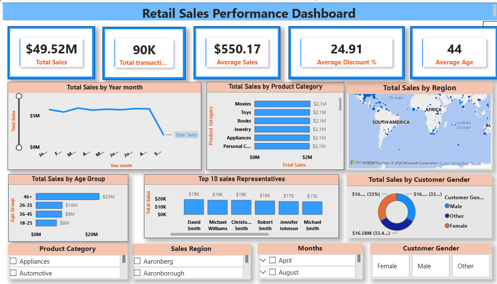
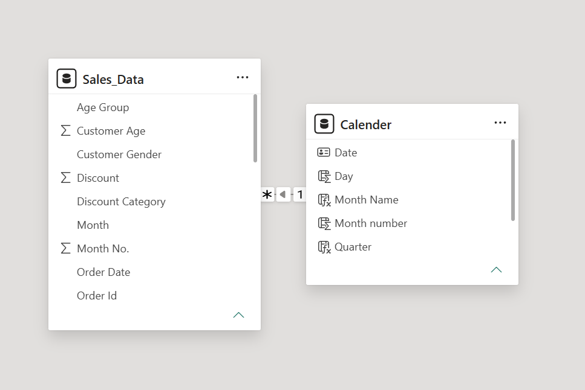

#  Retail Sales Performance Dashboard

An interactive Power BI dashboard developed to analyze retail sales performance from "January 2024 to September 2024" using ""Power BI, Power Query, DAX, and Microsoft Excel".

#  Project Overview

This project demonstrates the complete Business Intelligence workflow:

- Data Cleaning in Excel
- Data Transformation using Power Query
- Data Modeling
- DAX Measure Creation
- Interactive Dashboard Development
- Business Insights
- Business Recommendations

The dashboard enables stakeholders to monitor sales performance and make data-driven business decisions.

---

# Tools & Technologies Used

| Tool | Purpose |
|------|----------|
| Microsoft Excel | Initial data cleaning and preprocessing |
| Power Query | Data transformation and feature engineering |
| Power BI Desktop | Dashboard development |
| DAX | KPI and business measure creation |
| GitHub | Project version control and portfolio publishing |

---

# Dataset Information

- "Dataset Name:" Retail Sales Dataset
- "Total Records:" 100,000
- "Time Period:" January 2024 – September 2024
- "Data Type:" Retail Sales Transactions
- "File Format:" CSV

### Dataset contains:

- Order ID
- Order Date
- Product Category
- Product Name
- Sales Amount
- Discount
- Customer Age
- Customer Gender
- Sales Representative
- Sales Region

---

# Dashboard Preview

The following dashboard provides an interactive overview of retail sales performance.

---

# Project Objectives

The primary objectives of this project are:

- Analyze retail sales performance from January 2024 to September 2024.
- Identify top-performing product categories.
- Analyze customer purchasing behavior based on age and gender.
- Evaluate regional sales performance.
- Measure the impact of discounts on sales.
- Identify the top-performing sales representatives.
- Generate business insights to support strategic decision-making.

---

#  Data Cleaning Process

The dataset was initially cleaned in Microsoft Excel before importing into Power BI.

The following steps were performed:

- Removed duplicate records.
- Removed rows containing blank values in critical columns.
- Verified row count before and after cleaning.
- Standardized column names.
- Saved the cleaned dataset as a new CSV file.

The cleaned dataset was then imported into Power BI for further transformation.

---

# Power Query Transformations

The following transformations were performed in Power Query:

- Changed data types.
- Sorted Order Date in ascending order.
- Created Year column.
- Created Quarter column.
- Created Month Name column.
- Created Month Number column.
- Created Age Group column.
- Created Discount Category column.
- Renamed columns for better readability.

---

# Data Model

A star schema data model was implemented to support efficient reporting and time-based analysis.

>Tables Used

Fact Table
- Sales_Data

Dimension Table
- Calendar

>Relationship

- Sales_Data[Order Date] → Calendar[Date]
- Relationship Type: Many-to-One (*:1)
- Cross Filter Direction: Single

The Calendar table enables efficient Year, Quarter, Month, and Date-based analysis.

---

# Dashboard KPIs

The dashboard provides the following key performance indicators (KPIs):

| KPI | Value |
|------|---------:|
| Total Sales | $49.52M |
| Total Transactions | 90K |
| Average Sales | $550.17 |
| Average Discount | 24.91% |
| Average Customer Age | 44 Years |

---

# 📊 Dashboard Visualizations

The dashboard includes the following interactive visuals:

- KPI Cards
- Monthly Sales Trend
- Sales by Product Category
- Sales by Region (Map)
- Sales by Customer Age Group
- Top 10 Sales Representatives
- Customer Gender Distribution
- Interactive Slicers for:
  - Product Category
  - Sales Region
  - Month
  - Customer Gender

---

# DAX Measures

The following DAX measures were created for analysis:

| Measure | Purpose |
|---------|---------|
| Total Sales | Calculates overall revenue |
| Total Transactions | Counts total orders |
| Average Sales | Average sales per transaction |
| Average Discount % | Average discount provided |
| Average Customer Age | Average age of customers |
| Top 10 Sales Representatives | Identifies highest-performing representatives |
| Sales (Age Group 26–35) | Calculates sales from customers aged 26–35 |
| Female Sales with High Discount | Calculates sales where Female customers received discounts greater than 30% |

---

# Business Insights

Based on the dashboard analysis, the following insights were identified:

> Overall Performance

- Total Sales reached "$49.52 Million".
- More than "90,000 transactions" were recorded.
- Average Sales per transaction was "$550.17".

> Customer Insights

- Customers aged "46+ generated the highest sales revenue."
- Sales were distributed almost equally among Male, Female, and Other customers.

> Product Insights

- Movies, Toys, Books, Jewelry, Appliances and Personal Care products generated consistently high sales.

> Regional Insights

- Sales were recorded across multiple regions indicating a broad customer base.

> Sales Representative Insights

- David Smith and Michael Williams ranked among the highest-performing sales representatives.

> Discount Analysis

- The average discount offered was "24.91%".
- Discounts contributed to increased sales while maintaining healthy revenue.

---

# Business Recommendations

Based on the analysis, the following recommendations are suggested:

- Increase inventory for top-selling product categories.
- Focus marketing campaigns on customers aged 46 and above.
- Reward high-performing sales representatives through incentive programs.
- Optimize discount strategies to improve profitability.
- Expand marketing efforts in high-performing regions.
- Improve customer retention through loyalty programs.
- Continue monitoring monthly sales trends for seasonal planning.

---
